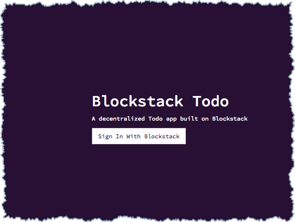
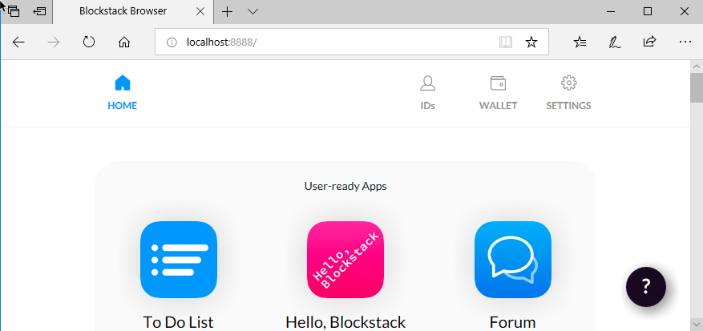
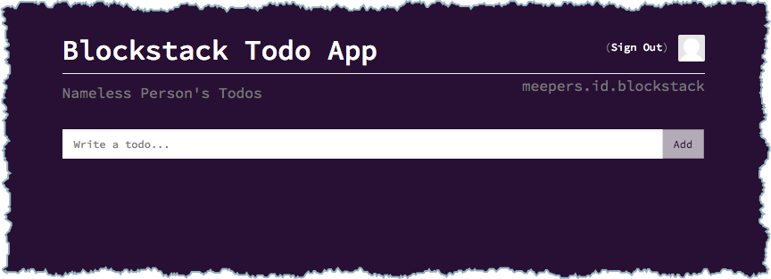
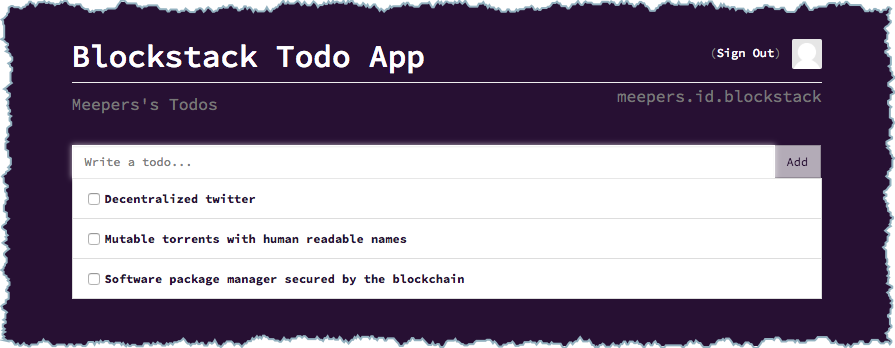

In this tutorial, you build the code for and run a single-page application (SPA)
with Blockstack and Vue.js. Once the application is running, you take a tour
through the applications' Blockstack functionality. You'll learn how it manages
authentiation using a Blockstack ID and how it stores information associated
with that ID using Blockstack Storage (Gaia).

## Prerequisites

Make sure you have [created at least one Blockstack ID](ids-introduction#create-an-initial-blockstack-id). You'll use this ID to Finteract with the Todo application.

The applicaton code relies on both the `npm` and  the `yarn` package managers.
Before you begin, verify you have these tools `npm` using the `which` command to
verify.

```bash
$ which npm
/usr/local/bin/npm
$ which yarn
/usr/local/bin/yarn
```

[Install npm](https://www.npmjs.com/get-npm), [install
yarn](https://yarnpkg.com/lang/en/docs/install/#mac-stable), or both as needed. You

While it stands alone, this tour does on the information from the [Hello
Blockstack tutorial](hello-blockstack). If you haven't worked through that
tutorial, you may want to do that before continuing.


## Install the applicaton code and retrieve the dependencies

You can clone the source code with  `git` or [download and unzip the code from
the
repository](https://github.com/blockstack/blockstack-todos/archive/master.zip).
These instructions assume you are cloning.


1. Install the code by cloning it.

    ```
    $ git clone git@github.com:blockstack/blockstack-todos.git
    ```

2. Change to directory to the root of the code.

    ```
    $ cd blockstack-todos
    ```

2. Use yarn to install the dependencies.


    ```
    $ yarn install
    yarn install v1.9.2
    info No lockfile found.
    ...
    [4/5] 🔗  Linking dependencies...
    [5/5] 📃  Building fresh packages...
    success Saved lockfile.
    ✨  Done in 19.90s.
    ```

## Understand the important application files

The Todo application has a basic Vue.js structure. There are several configuration files but the central programming files are in the `src` directory:

| File            | Description |
|-----------------|-------------|
| `main.js`       | Application initialization.            |
| `App.vue `      | Code for handling the `authResponse`.        |
| `Landing.vue `  | Code for the initial sign on page.            |
| `Dashboard.vue` | Application data storage and user sign out.           |

The example application runs in a node server on your local host. In the next section, you start the application and interact with it.

1. Start the application.

    ```
    $ npm run start
    ```

    You should see a simple application:

    

 2. Choose **Sign In with Blockstack**.


## Understand the sign in process

At startup, the Todo application detects whether the user has the Blockstack client edition
installed or not. This is done automatically by the Blockstack API, more
about this later. What the authenticator displays depends on which whether the user has installed the Blockstack Authenticator client edition or not.

| Client edition installed | Not installed |
|------------------|-----------------------------------|
|   | |

If the user was logged into the Blockstack authenticator (web or client) but
did not reset it, the web application to use the current identity:


If the user chooses **Deny**, the Blockstack authenticator opens but the user
is not logged into the sample application.



If the login to the application is successful, the user is presented with the application:



Clicking the **Sign In With Blockstack** button brings up a modal that prompts
you to use an existing ID's session, create a new ID, or reset the browser with
another ID.  When Blockstack is provided an ID, it  generates an _ephemeral key_
within the application. An ephemeral key is generated for each execution of a
key establishment process. This key is just used for the particular instance of
the application, in this case to sign a **Sign In** request.

Blockstack also generates a public key token which is sent to the authenticator
as an `authRequest` from the authenticator to your local blockstack-core node.
The signed authentication request is sent to Blockstack through a JSON Web
Token. The JWT is passed in via a URL query string in the `authRequest`
parameter:
`https://browser.blockstack.org/auth?authRequest=j902120cn829n1jnvoa...`. To
decode the token and see what information it holds:

1. Copy the `authRequest` string from the URL.
2. Navigate to [jwt.io](http://jwt.io/).
3. Paste the full token there.

   The output should look similar to below:

    ```json
    {
      "jti": "3i96e3ad-0626-4e32-a316-b243154212e2",
      "iat": 1533136622,
      "exp": 1533140228,
      "iss": "did:btc-addr:1Nh8oQTunbEQWjrL666HBx2qMc81puLmMt",
      "public_keys": [
        "0362173da080c6e1dec0653fa9a3eff5f5660546e387ce6c24u04a90c2fe1fdu73"
      ],
      "domain_name": "http://localhost:8080",
      "manifest_uri": "http://localhost:8080/manifest.json",
      "redirect_uri": "http://localhost:8080/",
      "version": "1.2.0",
      "do_not_include_profile": true,
      "supports_hub_url": true,
      "scopes": [
        "store_write"
      ]
    }
    ```

>**Note**:
> 1. The `iss` property is a decentralized identifier or `did`. This identifies you and your name to the application. The specific `did` is a `btc-addr`.
> 2. The Blockstack JWT implementation is different from other implementations because of the underlying cryptography we employ. There are libraries in [Javascript](https://github.com/blockstack/jsontokens-js) and [Ruby](https://github.com/blockstack/ruby-jwt-blockstack) available on the Blockstack Github to allow you to work with these tokens.

When the blockstack-core receives the `authRequest`, it generates a session token and
returns an authentication response to the application. This response is similar
to the `authRequest` above in that the `authResponse`  includes a private key
intended only for the application. This allows the application to encrypt data
on your personal Blockstack storage.

You are now logged into the Todo application!

## Undder the covers in the sign in code

Now, go to the underlying `blockstack-todo` code you cloned or downloaded. Sign
in and sign out is handled in each of these files:

| File            | Description |
|-----------------|-------------|
| `App.vue `      | Handles the `authResponse`.        |
| `Landing.vue `  | Generates the `authRequest`.        |
| `Dashboard.vue` | Handles sign out.           |

The `src/components/Landing.vue` code calls a [`redirectToSignIn()`](https://blockstack.github.io/blockstack.js#redirectToSignIn) function which generates the `authRequest` and redirects the user to the Blockstack authenticator:

```js
signIn () {
  const blockstack = this.blockstack
  blockstack.redirectToSignIn()
}
```

Once the user authenticates, the application handles the `authResponse` in the `src/App.vue` file. :

```js
if (blockstack.isUserSignedIn()) {
  this.user = blockstack.loadUserData().profile
} else if (blockstack.isSignInPending()) {
  blockstack.handlePendingSignIn()
  .then((userData) => {
    window.location = window.location.origin
  })
}
```

If [`blockstack.isUserSignedIn()`](https://blockstack.github.io/blockstack.js/#isusersignedin) is true, the user was previously signed in so Blockstack pulls the data from the browser and uses it in our application. If the check on  [`blockstack.isSignInPending()`](https://blockstack.github.io/blockstack.js/#issigninpending) is true, a previous `authResponse` was sent to the application but hasn't been processed yet. The `handlePendingSignIn()` function processes any pending sign in.

Signout is handled in `src/components/Dashboard.vue`.
```js
signOut () {
  this.blockstack.signUserOut(window.location.href)
}
```

The method allows the application creator to decide where to redirect the user upon Sign Out:


## Working with the application

Now trying adding a few todos using the application. For example, try making a list of applications you want to see built on top of Blockstack:



Each list is immediately stored in the Gaia Hub linked to your Blockstack ID.
For more information about the Gaia hub, see the [hub
repository](https://github.com/blockstack/gaia). You can fetch the `todos.json`
file you just added by opening the Javascript console and running the following
command:

```Javascript
blockstack.getFile("todos.json", { decrypt: true }).then((file) => {console.log(file)})
```

You should see a JSON with the todos you just added:

```json
[
  {
    "id":2,
    "text":"Software package manager secured by the blockchain",
    "completed":false
  },
  {
    "id":1,
    "text":"Mutable torrents with human readable names",
    "completed":false
  },
  {
    "id":0,
    "text":"Decentralized twitter",
    "completed":false
  }
]
```


Now, add another todo and check it off. When you fetch the newly generated file
using the Javascript console it will reflect the change look for `"completed":true`:

```json
[
  {
    "id":3,
    "text":"Blockstack Todo",
    "completed":true
  },
  {
    "id":2,
    "text":"Software package manager secured by the blockchain",
    "completed":false
  },
 ...
]
```

Now that you have seen the application in action, dig into how it works.


## Implementing storage

Now, go to the underlying `blockstack-todo` code you cloned or downloaded. The
application interactions with your Gaia Hub originate in the
`src/components/Dashboard.vue` file. First lets see where the changes to the
Todos are processed:

```js
todos: {
  handler: function (todos) {
    const blockstack = this.blockstack

    // encryption is now enabled by default
    return blockstack.putFile(STORAGE_FILE, JSON.stringify(todos))
  },
  deep: true
}
```

Tje `todos` JSON object is passed in and the  [`blockstack.putFile()`](https://blockstack.github.io/blockstack.js/#putfile) method to store it in our Gaia Hub.

The code needs to read the Todo items from the storage with the [`blockstack.getFile()`](https://blockstack.github.io/blockstack.js/#getfile) method which returns a promise:

```js
fetchData () {
  const blockstack = this.blockstack
  blockstack.getFile(STORAGE_FILE) // decryption is enabled by default
  .then((todosText) => {
    var todos = JSON.parse(todosText || '[]')
    todos.forEach(function (todo, index) {
      todo.id = index
    })
    this.uidCount = todos.length
    this.todos = todos
  })
},
```

The `todos` data is retrieved from the promise.


## Summary

You now have everything you need to construct complex applications complete with authentication and storage on the Decentralized Internet. Why not try coding [a sample application that accesses multiple profiles](multi-player-storage.md).

If you would like to explore the Blockstack APIs, you can visit the [Blockstack Core API](https://core.blockstack.org/) documentation or the [Blockstack JS API](https://blockstack.github.io/blockstack.js).

 Go forth and build!
